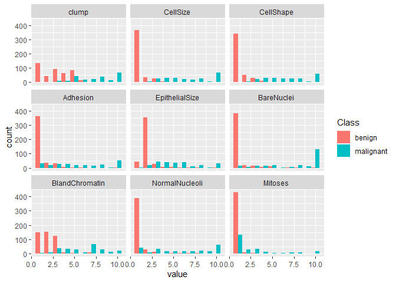

(1) Read the file to a data frame and figure out if there are missing values.


```r
data <- read.table("breast_cancer.csv",sep=",",header=T,stringsAsFactors = TRUE,na.strings = c("?")) #Missing Values are ?
print("Are there any missing Values?")
```

```
## [1] "Are there any missing Values?"
```

```r
print(sum(is.na(data))>0) #We see if there are more than zero missing values
```

```
## [1] TRUE
```

(2) If there are missing values, figure out which columns have missing values.


```r
print("Names of Columns with missing values")
```

```
## [1] "Names of Columns with missing values"
```

```r
colnames(data)[colSums(is.na(data))>0] #We use logical subsetting and colnames function to print columns with missing value
```

```
## [1] "clump"          "CellShape"      "Adhesion"       "BareNuclei"    
## [5] "NormalNucleoli"
```


(3) Remove rows that contain any missing values(use complete.cases function in R).


```r
dataUpdated <- data[complete.cases(data), ] #complete.cases give out rows with no NA; we paste it to new data frame
```


(4) Compute the average value of each column (column 2 to column 10) for benign
and malignant samples separately. 


```r
dataBenign <- dataUpdated[dataUpdated$Class=="benign",]
colMeans(dataBenign[,2:10]) #we find colMeans after logical subsetting the rows which equals to benign.
```

```
##          clump       CellSize      CellShape       Adhesion EpithelialSize 
##       2.963801       1.307692       1.416290       1.348416       2.108597 
##     BareNuclei BlandChromatin NormalNucleoli        Mitoses 
##       1.348416       2.085973       1.262443       1.056561
```

```r
dataMalignant <- dataUpdated[dataUpdated$Class=="malignant",]
colMeans(dataMalignant[,2:10])
```

```
##          clump       CellSize      CellShape       Adhesion EpithelialSize 
##       7.168776       6.586498       6.569620       5.611814       5.345992 
##     BareNuclei BlandChromatin NormalNucleoli        Mitoses 
##       7.662447       5.991561       5.877637       2.616034
```


(5) Using ggplot2, generate a histogram plot (binsize = 1) that looks like below. 


```r
new_data <- melt(dataUpdated[,2:11])
ggplot(data=new_data)+geom_histogram(aes(value, fill = Class),binwidth = 1,  position = "dodge")+facet_wrap(~variable)
```

<!-- -->


Task 5 generates a panel of histograms for each column in the data frames; the columns represent the value from 1 to 10 of attributes interrelated with Breast Cancer. The histogram represents the frequencies separated by two Classes (Benign and Malignant) with their distinctive colors. Overall, the histograms representing "benign" is mostly right-skewed and the mode (highest frequencies) is at 1. From Task 4, we observe that the averages of Malignant are higher than the averages for Benign. We can also observe that the number of benign cases are higher than the number of malignant cases within the entire dataframe. 

For columns CellSize, CellShape, Adhesion, BareNuclei, NormalNucleoli: These histograms are very similar. "Benign" is right-skewed with the mode at 1. "Malignant is more distributed but left-skewed with the modes at the highest value(10). We can inference that benign cells hold the value of 1 mostly but value increases when cancer cells are malignant. 

For columns BlandChromatin and clump: "Benign" is still right-skewed but is more distributed across lower values. Malignant cells have higher values than benign.

For column Mitoses: Both Bengign and Malignant histograms are right-skewed. However in this histogram, it is very noticeable that the total number of benign cases are higher than the total number of malignant cases.

