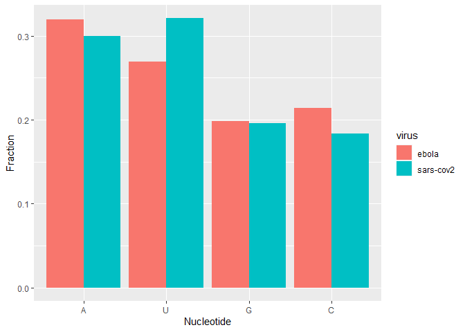

First read the sequences of these viruses in two different R variables. 


```r
library("tidyverse")
library("reshape2")

ebola <- read.table("ebola.txt", stringsAsFactors = FALSE)
sarscov2 <- read.table("sars-cov2.txt", stringsAsFactors = FALSE)
```
•	Replace each occurrence of 'T' by 'U' in both the sequences. 

```r
ebola <- str_replace_all(ebola,"T" ,"U" )  
sarscov2 <- str_replace_all(sarscov2,"T" ,"U" )
```
•	Find the length of the sequence of the two viruses.


```r
str_length(ebola)
```

```
## [1] 18957
```

```r
str_length(sarscov2)
```

```
## [1] 29903
```


Display the last 20 characters in the sequences of the viruses. 


```r
str_extract(ebola, ".{20}$")
```

```
## [1] "UUUCUUCUUUUUUGUGUGUC"
```

```r
str_extract(sarscov2, ".{20}$")
```

```
## [1] "AAAAAAAAAAAAAAAAAAAA"
```

```r
print("There is substantial differences in the nucleotide sequences between the two.")
```

```
## [1] "There is substantial differences in the nucleotide sequences between the two."
```

•	Find out the fraction of times the four nucleotides A, U, G, and C occur in the virus sequence. 


```r
eboladf <- data.frame("A" = c(str_count(ebola, "A")/str_length(ebola), str_count(sarscov2, "A")/str_length(sarscov2)),
                "U" = c(str_count(ebola, "U")/str_length(ebola), str_count(sarscov2, "U")/str_length(sarscov2)),
                "G" = c(str_count(ebola, "G")/str_length(ebola), str_count(sarscov2, "G")/str_length(sarscov2)),
                "C" = c(str_count(ebola, "C")/str_length(ebola), str_count(sarscov2, "C")/str_length(sarscov2)),
                "virus" = c("ebola", "sars-cov2"))
eboladf
```

```
##           A         U         G         C     virus
## 1 0.3191961 0.2690299 0.1981326 0.2136414     ebola
## 2 0.2994348 0.3208374 0.1960673 0.1836605 sars-cov2
```

•	Write R code to visualize the above results as a bar plot shown below:


```r
graph <- melt(eboladf, value.name = "Fraction", variable.name = "Nucleotide") #We use melt function
ggplot(graph, aes(x = Nucleotide, y = Fraction, fill = virus)) + geom_bar(stat = "identity", position = "dodge") 
```

<!-- -->

